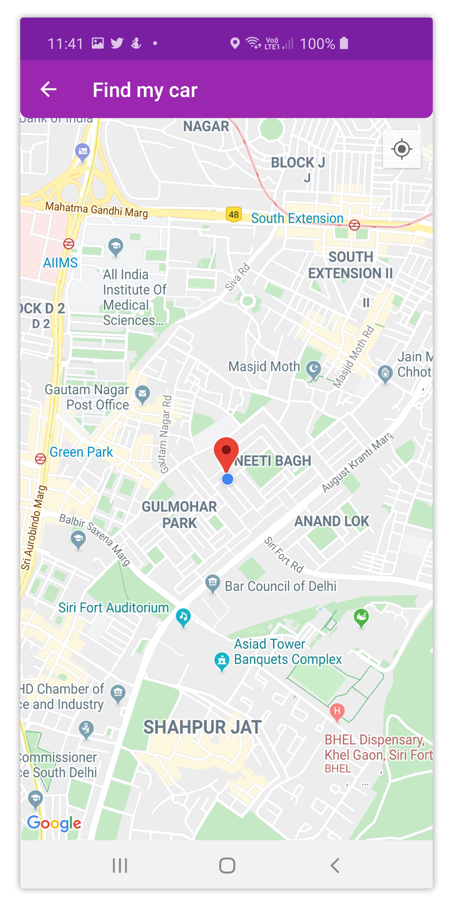

# OneStopShop App

## Overview
> [HackVSIT Hackathon Project](https://hack-vsit.tech/)

Complete Suite for mall-goers, creating a paperless, seamless, secure and efficient shopping for all customers and simultaneously taking care of nature. 🍀

## Features

### Smart Billing 
This feature will enable paperless and seamless billing. This not only reduces deforestation to a considerable extent but also reduces the carbon footprint . It will also decrease the use of chlorine and chlorine dioxide while paper making process.
After each Shopping user will receive points which will be redeemable in your next shopping.

### SOS
This feature is for the safety of the shoppers in Malls or Retail Shops. When the shopper activates this feature, it will alarm the security via an IoT device with the exact location of the shopper so that the security can take further action to solve the issue.

### Smart Vehicle Parking
Many times we forget where we parked our cars in the parking lot.
This feature will help shoppers search their car in the parking-lot by tracking them back to their cars. This will save time and energy of the shoppers.

### All the Deals in one app
We have encountered situtaions in which we hop in and out of many different stores to find the right stuff for the right price! no more hopping as we introduce smart shopping where wou can get all the deals in the mall by just scanning a single QR code. 

> © 2020 Git Rebels, made with love ❤️
